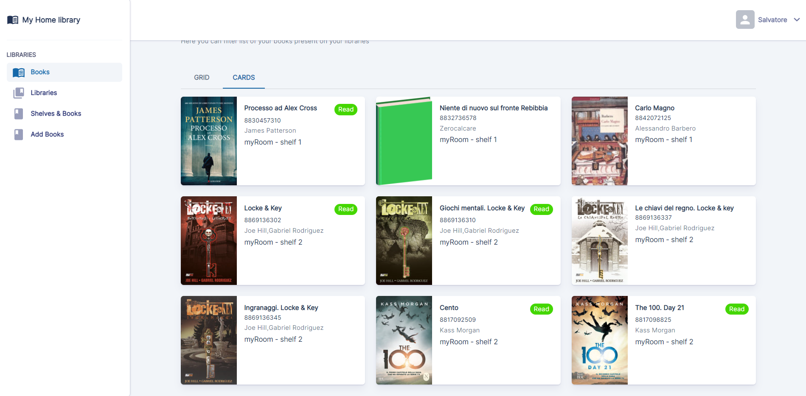

<p align="center">

</p>

<h1 align="center"> Home Library - Frontend </h1>

### Introduction

This project has been designed for web programming class at the University of Catania . In ì This repository show just the Frontend application, which was developed with [React](https://reactjs.org/).

To understand reason and goals of this application, and also to run backend side watch here: [Home-library-backend](https://github.com/borgesis95/home-library-backend).

### Getting started

Make sure to properly configured backend side .

First of all you need to clone the repo

```sh
git clone https://github.com/borgesis95/home-library-frontend.git

cd home-library-frontend
```

Install dependecies :

```sh
npm run install
```

Start application with :

```sh
npm run start
```

## Folders structure

````
./src
├── components  # contains all shared components that will be used in different pages.
├── contexts    # contains Context components like `<Sidebar/>` and ``` Notification Hook.
├── interface   # Typescript interface.
├── pages       # Pages of applications.
├── redux       # definition of the store , thunk and slice.
├── services    # API definition and axios's configuration.
├── theme       # MUI theme configuration
└── utils       # utils functions.
````

#### Features

- _Signup_ : From Signup pages you can create new user typing your name,email and password.
  <br>
- _Signin_ : Allow you to login into Home library app . Authentication flow has been handled with [Json Web Token](https://jwt.io/), therefore after you logged into the app, JWT will be used for every API call. User's informations are kept into Redux.
  <br>
- _Get and create new libraries_: You can create new libraries by entering two fields : "library name" , and if you want to share books that you have in that library . So if you share your book's list with your friends, maybe they can ask you to lent a book.
  <br>
- _Split up your bookshelf in shelf_: Before to insert book into your library, you have to add shelf.
  <br>
- _Add book_: Push book on selected shelf/library typing ISBN and some details or (if you don't find book via ISBN), you can add book manually (typing, ISBN,Author, title...).
  <br>

- _Book's list_ : Look and filters all your books . You choose between two diffeent views : Grid or Cards.

#### References

Main modules used for this app are :

- [Typescript](https://www.typescriptlang.org/)
- [MUI Library ](https://mui.com/)
- [Redux toolkit](https://redux-toolkit.js.org/)
